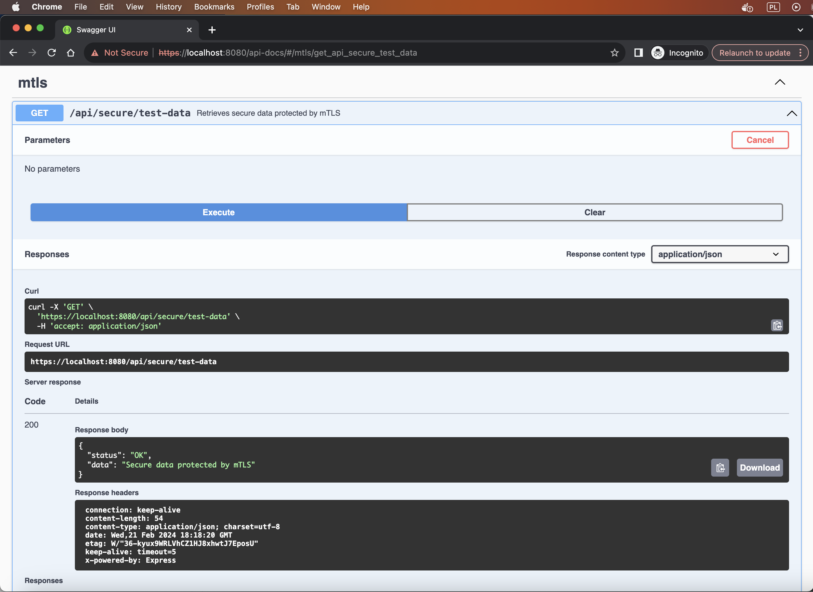

# Use scripts to creat Self-Signed Certificates for Local mTLS Testing

In this folder, you'll find two scripts that you may use for setting up and testing mTLS locally:

`generate_certificate.sh` - This script generates the **server** and **client** keys needed to set up a **secure mTLS connection**. It's straightforward and tailored for **local development** and testing. After running the script besides the above keys, you'll get **copy_these_keys_to.env.local** file that containse base64-encoded environment variables for the server. Simply copy the content of the file into **.env.local** file, and after build node server will be ready to recognize these credentials.

There is also included a `client_tests.sh` script for a quick validation of local mTLS setup. It runs tests making HTTP requests with and without the client certificate using curls, showing that the setup works localy.

```console
$ ./client_tests.sh
Testing request WITH client certificate...
Test with certificate PASSED: Able to access https://localhost:8080/api/secure/test-data
Response: {"status":"OK","data":"Secure data protected by mTLS"}

Testing request WITHOUT client certificate...
Test without certificate PASSED: Correctly denied access to https://localhost:8080/api/secure/test-data
```

You can also run the `client.js` javascript client via Node.js to test local mTLS (btw, just don't forget to run NET.ts server before you start testing those clients ;).

```console
node client.js
Attempt to call: https://localhost//api/secure/test-data:8080 with client certificate and key
SERVER RESPONSE
STATUS: 200
Response body: {"status":"OK","data":"Secure data protected by mTLS"}
--
```

Important: For a production-ready solution, it's essential to use certificates signed by a trusted Certificate Authority (CA) to ensure the highest level of security and trustworthiness of mTLS setup.

If you need this setup to work on <strong>AWS</strong>, just drop me a line.

# How to use client certificate in the browser

If you've had a chance to check the `/api/secure/test-data endpoint` via browser, you've probably noticed that the response you received is as follows:


Why is this so? Because this particular endpoint is protected by mTLS middleware, which means that to access this endpoint, you need to provide a client certificate. Examples of how to access it through curl and JavaScript client have been already provided. However, as a last resort, you can use your browser. To enable this endpoint to work from your browser, first, you need to have a single file that combines the private key and the client certificate. You must then provide this file in the PKCS #12 format for your browser. To achieve this, we will use OpenSSL to prepare the `.p12` file, which is the file extension for this format.

```console
openssl pkcs12 -export -out certificate.p12 -inkey client.key -in client.crt
```

Now, with a `certificate.p12` file, you can import it into your Keychain. Make sure to import it into the 'login' keychain to ensure your browser can access it.
btw. You'll be prompted for the password used when creating the `.p12` file.


When imported, double-click it, expand the "Trust" section, and set "When using this certificate" to "Always Trust" for SSL. For certificates signed by a trusted Certificate Authority you can skip this step.


Finally when you access a website that requires client authentication (`https://localhost:8080/api-docs/`), the browser should prompt you to select a certificate:


Ensure the server is configured to request a client certificate, and your certificate matches the server's requirements.

If so, calling `/api/secure/test-data endpoint` endpoint from the browser should yield the following result:



For folks who work on Windows:
https://velmuruganv.wordpress.com/2020/04/27/mtls-mutual-tls-authentication-chrome/

Troubleshooting

- If you experience UserError: security: SecKeychainItemImport: MAC verification failed during PKCS12 import (wrong password?) make sure you have legacy libraries in your OpenSSL path.
